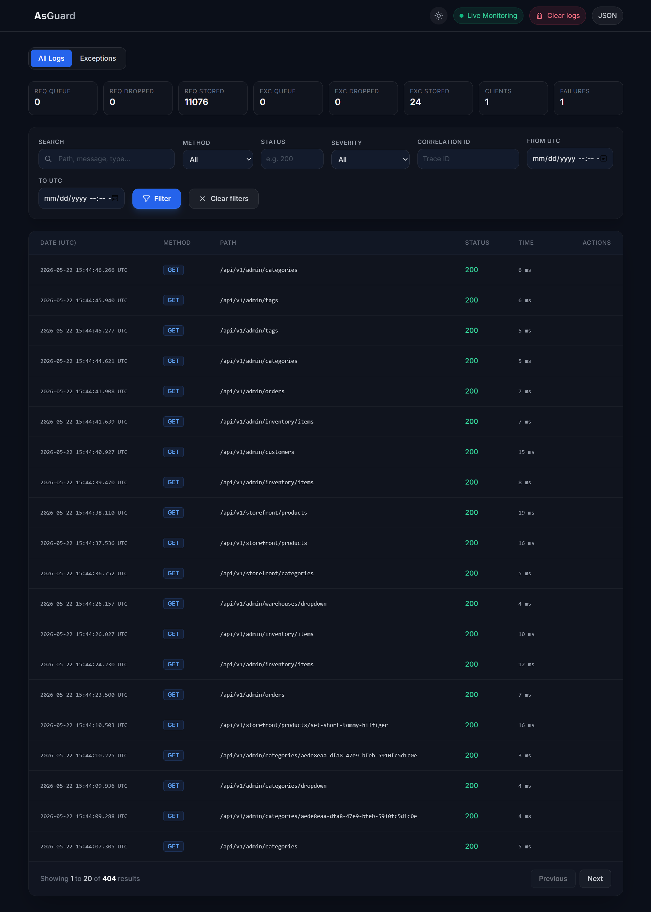

# AsGuard

[](https://www.nuget.org/packages/AsGuard/)
[](https://www.nuget.org/packages/AsGuard/)
[](https://dotnet.microsoft.com/)
[](LICENSE)

**AsGuard** is an ASP.NET Core monitoring package for request logging, exception tracking, host `ILogger` capture, live Server-Sent Events (SSE) updates, and a built-in dashboard.

No external services required. No complex observability stack. Just visibility.

---

## ✨ Features

| Feature | Description |
|---------|-------------|
| 🚀 **Queue-based persistence** | Non-blocking async writes - your API never waits for database |
| 📊 **Built-in dashboard** | Beautiful Razor UI with dark/light mode and live updates |
| 🔒 **Sensitive data masking** | `[AsGuardMasked]` attribute + configurable header redaction |
| 📝 **Body capture** | Request/response bodies with content-type allowlist |
| 🔗 **Correlation IDs** | Distributed tracing with configurable headers (default: `X-Correlation-ID`) |
| ⏱️ **APM & Trace Timelines** | Auto-tracks DB queries (EF Core) and HttpClient calls with Gantt charts |
| ⚡ **Live SSE updates** | Real-time push notifications without SignalR |
| 🗄️ **Multiple databases** | SQL Server, PostgreSQL, SQLite, or In-Memory |
| 📈 **Exception analytics** | Trends, severity summaries, and configurable alerts |
| 🎯 **Host ILogger capture** | Automatically captures `ILogger<T>` warnings/errors |
| 🔔 **Alerting system** | Queue pressure, exception spikes, persistence failures |
| 📡 **REST API** | Full programmatic access to logs and stats |
| 🧹 **Retention policies** | Auto-cleanup with configurable intervals |

---


---

## 📦 Installation

```bash
dotnet add package AsGuard
```


## 🚀 Quick Start

Add these lines to your `Program.cs`:

```csharp
using AsGuard.Domain.RequestLogging;
using AsGuard.Extensions;

var builder = WebApplication.CreateBuilder(args);

// Add AsGuard services
builder.Services.AddRequestLogging(options =>
{
    // Use SQLite (no external database setup required)
    options.DatabaseProvider = LoggingDatabaseProvider.Sqlite;
    options.ConnectionString = "Data Source=AsGuard.db";
    
    // Dashboard configuration
    options.DashboardRoute = "/logs";
    options.DashboardUsername = builder.Configuration["AsGuard:Username"] ?? "admin";
    options.DashboardPassword = builder.Configuration["AsGuard:Password"] ?? "change-me";
    
    // Capture exceptions and host logs
    options.EnableExceptionLogging = true;
    options.CaptureHostLogs = true;
});

var app = builder.Build();

// Add AsGuard middleware (before your endpoints)
app.UseRequestLogging();

app.Run();
```

Run your app and navigate to `/logs` to see the dashboard.

> ⚠️ **Security**: Always change default dashboard credentials in production. Store them in configuration, user secrets, or environment variables.

---

## 📚 Documentation

| Topic | Link |
|-------|------|
| Getting Started | [docs/getting-started.md](docs/getting-started.md) |
| Full Configuration | [docs/configuration.md](docs/configuration.md) |
| Request Logging | [docs/features/request-logging.md](docs/features/request-logging.md) |
| Exception Tracking | [docs/features/exception-tracking.md](docs/features/exception-tracking.md) |
| Enrichment & Correlation | [docs/features/enrichment-correlation.md](docs/features/enrichment-correlation.md) |
| Dashboard & API | [docs/features/dashboard-api.md](docs/features/dashboard-api.md) |
| Production & Alerts | [docs/features/alerts-production.md](docs/features/alerts-production.md) |
| APM & Trace Timelines | [docs/features/apm-tracing.md](docs/features/apm-tracing.md) |

### External Resources

- [Getting Started Guide on Medium](https://medium.com/@mahmood.alsarraj/asguard-a-lightweight-request-exception-logger-for-asp-net-core-with-built-in-dashboard-0e58d414e486)

---

## ⚙️ Minimum Configuration Example

This is all you need to start logging:

```csharp
builder.Services.AddRequestLogging(options =>
{
    options.DatabaseProvider = LoggingDatabaseProvider.Sqlite;
    options.ConnectionString = "Data Source=logs.db";
    options.DashboardRoute = "/asguard";
    options.DashboardUsername = "user";
    options.DashboardPassword = "pass";
});

app.UseRequestLogging();
```

---

## 🗄️ Database Support

| Provider | Configuration |
|----------|---------------|
| **SQLite** | `options.DatabaseProvider = LoggingDatabaseProvider.Sqlite;`<br>`options.ConnectionString = "Data Source=AsGuard.db";` |
| **SQL Server** | `options.DatabaseProvider = LoggingDatabaseProvider.SqlServer;`<br>`options.ConnectionString = "Server=.;Database=AsGuard;Trusted_Connection=true;";` |
| **PostgreSQL** | `options.DatabaseProvider = LoggingDatabaseProvider.PostgreSql;`<br>`options.ConnectionString = "Host=localhost;Database=AsGuard;Username=postgres;Password=pass";` |
| **In-Memory** | `options.DatabaseProvider = LoggingDatabaseProvider.InMemory;`<br>`options.MaxInMemoryEntries = 10000;` |

> 💡 **Recommendation**: Use SQLite for development/small apps. Use SQL Server or PostgreSQL for production.

---

## 🔒 Sensitive Data Protection


Mask sensitive JSON properties with the `[AsGuardMasked]` attribute:

```csharp
public class LoginRequest
{
    public string Username { get; set; }
    
    [AsGuardMasked]
    public string Password { get; set; }  // Becomes "[REDACTED]" in logs
}
```

Or configure keys globally:

```csharp
options.SensitiveBodyKeys.Add("creditCardNumber");
options.SensitiveBodyKeys.Add("ssn");
```

---

## 📊 Dashboard Preview

The built-in dashboard includes:

- **Request log browser** with filtering (method, status, search)
- **Exception log viewer** with severity filtering
- **Correlation ID tracking**
- **Live updates** via SSE
- **Light/Dark mode**
- **Log clearing** functionality


## 🤝 Contributing

Contributions are welcome! Please read [CONTRIBUTING.md](CONTRIBUTING.md) for guidelines.

Ways to contribute:
- 🐛 Report bugs via GitHub Issues
- 💡 Suggest features via GitHub Issues
- 📝 Improve documentation
- 🌟 Star the repository
- ❓ Help others on GitHub Discussions

---

## 📄 License

AsGuard is **free for production use** under a source-available license.

- ✅ Use in commercial applications
- ✅ Use in open source projects
- ✅ Deploy to production
- ❌ Redistribute the source code
- ❌ Offer as a competing hosted service

See [LICENSE](LICENSE) for full terms.

---

## 💬 Community & Support

| Channel | Purpose |
|---------|---------|
| [GitHub Issues](https://github.com/mahmood-alsarraj/AsGuard/issues) | Bug reports and feature requests |
| [GitHub Discussions](https://github.com/mahmood-alsarraj/AsGuard/discussions) | Q&A, ideas, show and tell |
| [Medium Article](https://medium.com/@mahmood.alsarraj/asguard-a-lightweight-request-exception-logger-for-asp-net-core-with-built-in-dashboard-0e58d414e486) | Getting started tutorial |

---

**⭐ Star this repository if AsGuard helps you!**
