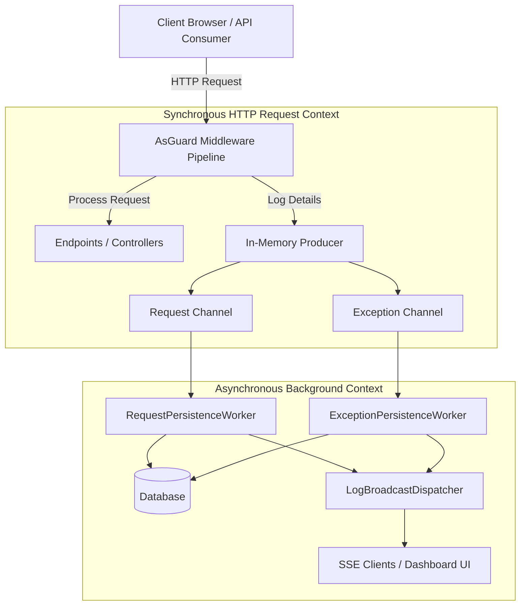

# AsGuard Documentation

Welcome to the official documentation for **AsGuard** – a high-performance, developer-friendly ASP.NET Core monitoring package for request/response logging, unhandled exception tracking, host `ILogger` capture, and observability.

AsGuard is designed for modern .NET teams who need **immediate, practical visibility** into HTTP traffic, unhandled errors, and warnings without the overhead of wiring up complex, multi-layered observability platforms (like Prometheus, ElasticSearch, or Jaeger) in the early to mid-stages of development or deployment.

---

## Technical Specifications & License

*   **Target Frameworks**: .NET 8, .NET 9, and .NET 10.
*   **License**: Source-available (completely free for production use).
*   **Hosting Requirements**: Compatible with any ASP.NET Core hosting model (Kestrel, IIS, HTTP.sys) using `WebApplication` or standard startup pipelines.
*   **Package URI**: [AsGuard on NuGet](https://www.nuget.org/packages/AsGuard/)
*   **Author**: Mahmood Alsarraj

---

## Core Architectural Overview

AsGuard is engineered with a **zero-blocking, high-throughput philosophy**. Traditional request logging libraries block the active HTTP request execution thread while writing logs to a database or disk, adding significant latency. 

AsGuard uses a modern, asynchronous producer-consumer architecture utilizing **System.Threading.Channels**:

### The Pipeline in Detail:
1.  **Request Middleware**: When an HTTP request enters your application, AsGuard measures duration, inspects headers, executes custom enrichers, and optionally captures request/response bodies (applying high-speed JSON masking rules dynamically).
2.  **Unbounded/Bounded Channels**: Instead of saving directly to the database, AsGuard writes request and exception logs directly into internal memory queues managed by `System.Threading.Channels`. This is a lock-free, high-performance operation taking a fraction of a microsecond.
3.  **Background Persistence Workers**: Long-running `IHostedService` workers run in the background. They poll the channels, aggregate logs, and save them in optimized bulk transactions (batches) to your database of choice (SQL Server, PostgreSQL, SQLite, or in-memory).
4.  **Live Stream Dispatcher**: New events are also sent to the `LogBroadcastDispatcher`, which broadcasts them in real time over a high-performance **Server-Sent Events (SSE)** stream directly to any active Dashboard instances.

---

## Feature Checklist

AsGuard comes packed with premium observability features out of the box:

*   **Traffic Monitoring**: Logs HTTP request method, path, query parameters, status codes, and execution duration.
*   **Body Capture**: Opt-in capture of request and response bodies up to configurable limits, restricted to defined content types (e.g. `application/json`).
*   **Data Security**: Always-on redaction of sensitive headers like `Set-Cookie`. Highly configurable `SensitiveHeaders` collections.
*   **JSON Data Masking**: Dynamic assembly scanning at startup for the `[AsGuardMasked]` attribute and manual property key configuration (`SensitiveBodyKeys`) to replace credentials or PII with `[REDACTED]` prior to storage.
*   **Error & Log Capture**: Unhandled HTTP exceptions are recorded automatically with complete stack traces. Plus, a built-in `ILoggerProvider` registers to redirect application warnings/errors to your logs dashboard.
*   **Manual Logging**: The `IExceptionLogger` interface allows you to queue warnings, errors, and handled exceptions from background workers, scheduled cron-jobs, or event consumers.
*   **Log Enrichment**: Claims-based user tracking (`sub`, `NameIdentifier`), inline enricher delegates (`EnrichLog`), and dependency injection-based scoping via `IAsGuardRequestEnricher`.
*   **Built-in Razor Dashboard**: A full-featured, secure dashboard supporting light and dark modes, instant search, UTC date filtering, severity filters, live SSE stream updates, and data-clear options.
*   **Comprehensive Web API**: Under the hood, the dashboard is powered by a fully documented, Basic-Auth protected REST API which includes runtime stats and diagnostic counters.
*   **Automated Retention**: An automated background cleaner deletes request and exception records older than a configured number of days (`RequestRetentionDays`, `ExceptionRetentionDays`).
*   **Proactive Alerting**: Built-in rules trigger alerts on high queue pressure, exception spikes (e.g. >25 errors in 5 mins), database persistence failures, or live streaming problems.
*   **Custom Alert Sinks**: Extend the alert engine by implementing `IAsGuardAlertSink` to dispatch system alerts directly to Slack, MS Teams, custom webhooks, or email.

---

## Next Steps

To get started with AsGuard in your application, follow the guides in order:

1.  **[Getting Started](getting-started.md)**: Add AsGuard to a new or existing ASP.NET Core project in under 5 minutes.
2.  **[Configuration Reference](configuration.md)**: Explore storage providers, performance tuning, and retention options.
3.  **[HTTP Traffic Monitoring](features/request-logging.md)**: Learn about body capture, JSON masking, and traffic sampling.
4.  **[Exceptions & Host Logs](features/exception-tracking.md)**: Understand unhandled errors, manual logging, and Microsoft logging integration.
5.  **[Enrichment & Correlation](features/enrichment-correlation.md)**: Group related processes and tag logs with user metadata.
6.  **[Dashboard & Web API](features/dashboard-api.md)**: Learn to secure and navigate the UI and leverage the underlying REST API.
7.  **[Alerts & Production Operations](features/alerts-production.md)**: Set up custom alert channels (Slack/Teams) and optimize for high-load systems.
8.  **[APM & Trace Timelines](features/apm-tracing.md)**: Trace database queries (EF Core) and downstream calls (HttpClient) with Gantt timelines.
